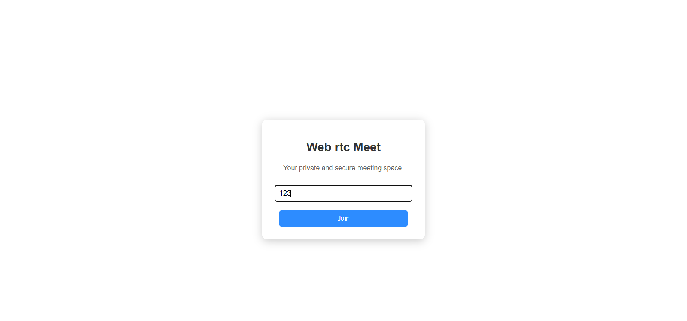
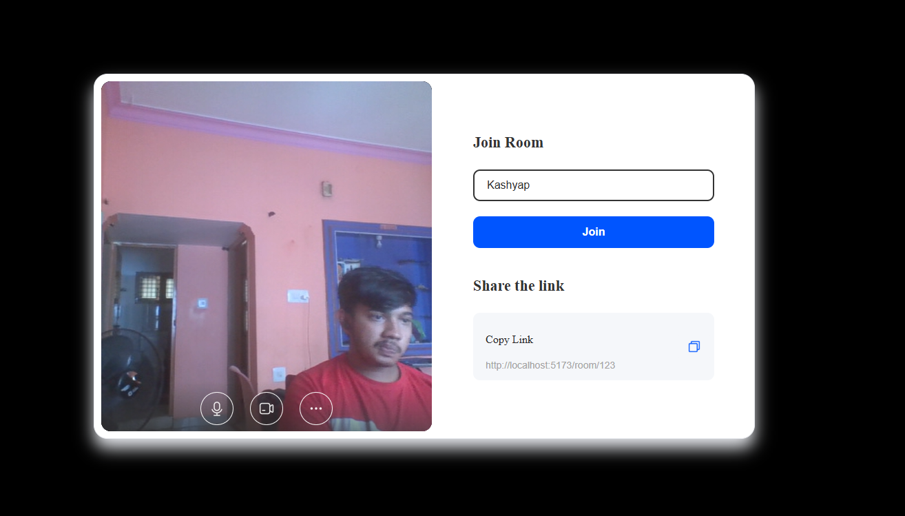
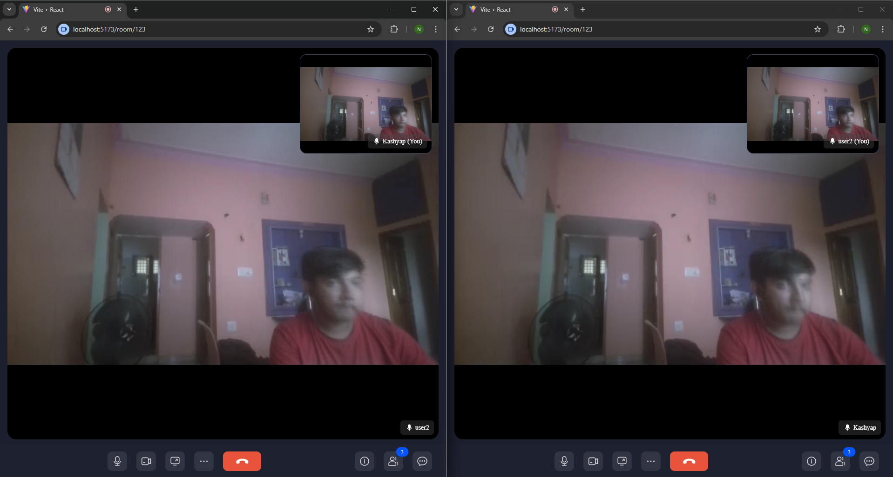

# 📹 WebRTC Video Calling App

A real-time video calling application built with **React + Vite**, powered by **ZegoCloud** for seamless peer-to-peer communication. Users can join a room and start a high-quality video call instantly through the browser.

---

## 🚀 Features

- 🔐 Room-based secure joining
- 🎥 High-quality video & audio communication
- ⚡ Real-time performance using **ZegoCloud**
- ⚛️ Fast and modern UI with **React + Vite**
- 📸 Screenshots of each screen included
- 💻 Fully responsive UI

---

## 🖼️ UI Screenshots

### 🔹 Welcome Page

### 🔹 Enter Room Page

### 🔹 In Call Screen

---

## 🛠️ Tech Stack

| Technology | Description |
|------------|-------------|
| React + Vite | Frontend Framework & Build Tool |
| ZegoCloud | WebRTC Video Calling SDK |
| JavaScript | Core Logic |
| HTML + CSS | Markup & Styling |

---

## 🧪 How It Works

1. **User enters a room ID**
2. **ZegoCloud SDK** handles authentication and video session
3. A second user joining the same room ID connects instantly
4. The call is peer-to-peer via WebRTC under the hood

---

